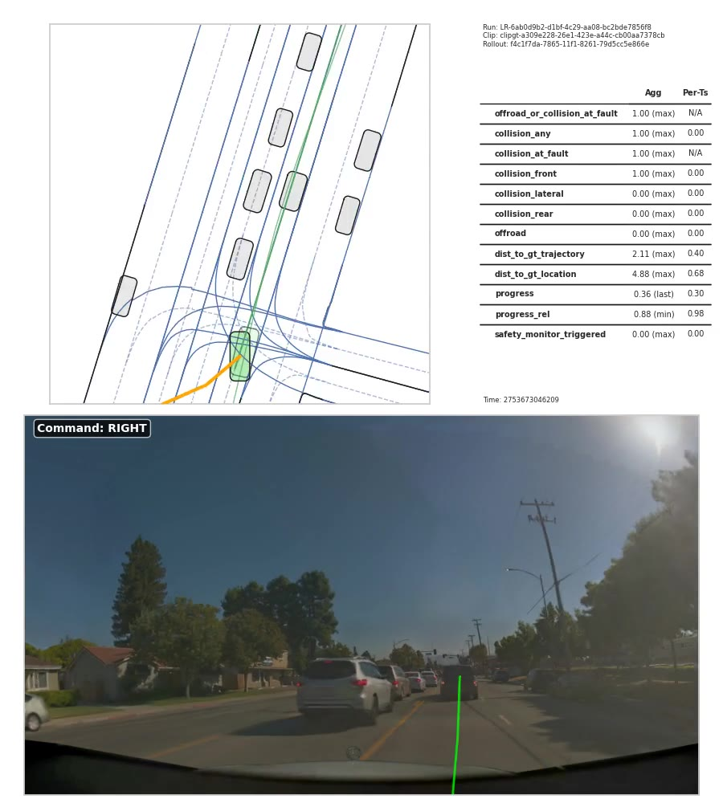

# WOD2Sim

<p align="center">
  <a href="https://github.com/amtellezfernandez/WOD2Sim/actions/workflows/ci.yml"></a>
  <a href="LICENSE"></a>
  
  
</p>

WOD2Sim is an **unofficial research bridge** for running WOD-style driving
policy adapters inside NVIDIA AlpaSim closed-loop simulation and packaging the
result as auditable evidence.

It connects three surfaces:

| Surface | Role |
| --- | --- |
| [Waymo Open Motion Dataset](https://waymo.com/open/data/motion/) | Logged multi-agent tracks, maps, Scenario protos, tensor examples, and public motion benchmarks. |
| [NVIDIA AlpaSim](https://github.com/NVlabs/alpasim) | Closed-loop AV simulation where policy decisions affect future observations. |
| WOD2Sim | Adapter code, launch CLI, run audit, support bundle, and benchmark summary JSON. |

## What You See

<table>
  <tr>
    <td width="50%">
      <a href="https://waymo.com/intl/jp/open/data/motion/">
        
      </a>
      <br>
      <strong>Waymo Motion input.</strong> Scenario-proto style tracks, prediction targets, interacting agents, and vector map geometry. Image is linked from the official Waymo Motion page, not copied into this repository.
    </td>
    <td width="50%">
      
      <br>
      <strong>AlpaSim rollout screenshot.</strong> Local closed-loop run with map view, per-timestep metrics, front camera, and the WOD2Sim external-driver command overlay.
    </td>
  </tr>
</table>

<p align="center">
  
</p>

<p align="center">
  
</p>

This repository is not affiliated with Waymo or NVIDIA. It does not redistribute
Waymo datasets, AlpaSim source/binaries, gated scene assets, private checkpoints,
full rollout videos, or support bundles. The README includes one derived AlpaSim
rollout screenshot and metrics plot from a local run to show what the integration
produces.

## Why This Exists

Waymo Motion is excellent for training and benchmarking motion behavior from
logged trajectories. It is not, by itself, a closed-loop runtime: the world does
not react to a submitted policy.

AlpaSim tests a different failure mode: what happens when the policy's own
actions change the rollout. WOD2Sim provides the bridge from WOD-style policy
signals to AlpaSim external-driver execution, then records the evidence needed to
review the run.

For the detailed dataset and simulator positioning, see
[`docs/waymo_motion_and_alpasim.md`](docs/waymo_motion_and_alpasim.md).

## Research Scope

WOD2Sim is a systems and evaluation artifact. It does not introduce a new
autonomous driving policy. Its contribution is the bridge that makes WOD-style
trajectory policies executable inside AlpaSim's closed-loop external-driver
runtime, then packages the run as reviewable evidence.

The current public release focuses on integration and reproducibility: setup
checks, launch materialization, driver logs, audits, support-bundle hashes, and a
recorded one-scene `spotlight_reflex` run. Large multi-scene benchmark studies,
policy-quality comparisons, and full Waymo-to-AlpaSim scene reconstruction are
outside this release. For benchmark claims and expected metrics, see
[`docs/evaluation_protocol.md`](docs/evaluation_protocol.md).

## Quick Start Without Private Assets

Install the package and run the public checks:

```bash
uv venv .venv
uv pip install --python .venv/bin/python -e ".[dev]"
wod2sim-doctor
make test
```

Create a reproduction plan. This does not need AlpaSim or gated assets:

```bash
wod2sim-reproduce \
  --scene-id example-scene \
  --run-dir /tmp/wod2sim-demo/run \
  --evidence-dir /tmp/wod2sim-demo/evidence \
  --json
```

Summarize the planned evidence:

```bash
wod2sim-benchmark-summary \
  --evidence-dir /tmp/wod2sim-demo/evidence \
  --output /tmp/wod2sim-demo/benchmark-summary.json \
  --json
```

The output is useful for reviewing the command path, but it intentionally reports
`valid_claim_evidence: false` until a real AlpaSim run executes.

## Closed-Loop Run With AlpaSim

With a local AlpaSim checkout, Docker/GPU runtime, cached scenes, and any
model-specific artifacts:

```bash
wod2sim-reproduce \
  --execute \
  --alpasim-root /path/to/alpasim \
  --model spotlight_reflex \
  --scene-preset front_camera_10scene_smoke \
  --run-dir runs/benchmark_spotlight_reflex_10scene_fresh \
  --evidence-dir runs/benchmark_spotlight_reflex_10scene_fresh/evidence \
  --json
```

For multi-scene closed-loop pilots, run scenes as independent statistical units:

```bash
wod2sim-batch \
  --mode both \
  --model spotlight_reflex \
  --scene-preset front_camera_10scene_smoke \
  --alpasim-root /path/to/alpasim \
  --batch-dir runs/benchmark_spotlight_reflex_10scene_fresh \
  --timeout 900 \
  --driver-warmup-seconds 5 \
  --max-retries 1 \
  --continue-on-error
```

Runtime compatibility is split by task:

| Task | Who Can Run It |
| --- | --- |
| Public package checks, dry reproduction plans, summaries | Any supported Python host; no AlpaSim assets required. |
| 26.02 local USDZ cache construction | Hosts with Hugging Face access, enough disk, and Python dependencies; GPU is not required. |
| Live AlpaSim closed-loop rollouts | x86_64 Linux hosts with Docker, NVIDIA GPU runtime, AlpaSim images, and cached scene artifacts. |
| ARM/Linux hosts | Supported for cache building and diagnostics only; live rollouts are blocked by default because the AlpaSim sensorsim image used here is amd64-only. |

The generated operator matrix is tracked at
[`docs/evidence/benchmark_operator_matrix_20260706.json`](docs/evidence/benchmark_operator_matrix_20260706.json)
and records which roles can review, build caches, run live shards, or promote
claim artifacts from the current evidence state. It also mirrors the rendered
command artifact's `command_execution` counts so the role matrix shows how many
public-review, cache, live-rollout, merge, and promotion commands map to each
operator role.
For a one-page public handoff with the current blocker IDs, role boundaries,
and next command groups, see
[`docs/benchmark_regeneration_handoff.md`](docs/benchmark_regeneration_handoff.md).

Set `WAYSPAN_ALLOW_UNSUPPORTED_ALPASIM_ARM=1` only when intentionally testing an
unsupported ARM rollout path.

For the larger 26.02 presets, first build a local USDZ directory from the
Hugging Face artifact revision. This uses each USDZ's `metadata.yaml` as the
source of truth and avoids relying on stale catalog UUIDs:

```bash
HF_TOKEN=... wod2sim-build-local-cache \
  --scene-preset front_camera_50scene_public2602 \
  --alpasim-root /path/to/alpasim \
  --local-usdz-dir /path/to/alpasim/data/nre-artifacts/local-2602-usdzs-50 \
  --workers 3

wod2sim-batch \
  --mode both \
  --model spotlight_reflex \
  --scene-preset front_camera_50scene_public2602 \
  --alpasim-root /path/to/alpasim \
  --batch-dir runs/benchmark_spotlight_reflex_50scene_public2602_fresh \
  --timeout 900 \
  --driver-warmup-seconds 5 \
  --max-retries 1 \
  --continue-on-error \
  --wizard-arg scenes.local_usdz_dir=/path/to/alpasim/data/nre-artifacts/local-2602-usdzs-50
```

Then publish compact summaries instead of raw gated artifacts:

```bash
wod2sim-batch-summary \
  --batch-dir runs/benchmark_spotlight_reflex_10scene_fresh \
  --output runs/benchmark_spotlight_reflex_10scene_fresh/wod2sim-batch-summary.json \
  --strict \
  --json

wod2sim-benchmark-summary \
  --evidence-dir runs/benchmark_spotlight_reflex_10scene_fresh/evidence \
  --output runs/wod2sim-benchmark-summary.json \
  --strict \
  --json
```

A local 10-scene `spotlight_reflex` pilot is summarized in
[`docs/evidence/closed_loop_spotlight_reflex_10scene_batch.json`](docs/evidence/closed_loop_spotlight_reflex_10scene_batch.json):
10/10 scenes completed, 1,990 audited frames, 0 failed scenes, and 0
sensor-pipeline failures. The closed-loop failure taxonomy for that pilot is 5
collision scenes, 2 at-fault collision scenes, 3 wrong-lane scenes, 0 offroad
scenes, and 7 low-progress scenes. These are policy/runtime evidence metrics,
not a claim that the current adapter is a strong driving policy.

A local one-scene `spotlight_reflex` run is summarized in
[`docs/evidence/closed_loop_spotlight_reflex_one_scene.json`](docs/evidence/closed_loop_spotlight_reflex_one_scene.json):
199 audited frames and 0 sensor failures. The raw rollout media and support
bundle are not tracked because they may contain AlpaSim or gated-scene-derived
content.

A diagnostic one-scene probe from the 50-scene public 26.02 preset is
summarized in
[`docs/evidence/closed_loop_spotlight_reflex_50scene_localprobe_1scene.json`](docs/evidence/closed_loop_spotlight_reflex_50scene_localprobe_1scene.json):
1/1 completed scene, 199 audited frames, 0 failed scenes, and 0
sensor-pipeline failures. This is scale-path evidence only; it is not a
claim-valid 50-scene summary and does not satisfy the strict audit gate.
The earlier partial 50-scene attempt is also tracked as non-claim evidence in
[`docs/evidence/closed_loop_spotlight_reflex_50scene_attempt_partial.json`](docs/evidence/closed_loop_spotlight_reflex_50scene_attempt_partial.json):
2/50 attempted scenes failed before audited frames were produced.

Open-repo readers can review the compact JSON summaries without AlpaSim, Docker,
or gated scene assets. Re-running or scaling the benchmark requires local access
to the gated assets plus an x86_64 NVIDIA/Docker AlpaSim host; ARM/DGX Spark
hosts can help with cache preparation but cannot run the amd64-only NRE
SensorSim image natively. The current regeneration and scale status is tracked
in
[`docs/evidence/benchmark_regeneration_status_20260706.json`](docs/evidence/benchmark_regeneration_status_20260706.json).
For 50/100-scene scale work, that file exposes
`scale_status.<preset>.local_usdz_cache` and
`scale_status.<preset>.source_usdz_cache`: the current public snapshot records
0 source USDZ files after local cleanup; `matching_scene_count` of `0` for both presets; no valid local scale cache; and no claim-valid scale summary.
Open-repo review can
inspect those fields, but cache building, live shard execution, and claim
promotion remain separate role-gated steps.
Regenerate that status from the tracked public evidence chain with
`wod2sim-benchmark-status`; it only reads compact JSON artifacts and does not
probe Docker, GPUs, or local scene caches.
The hash/size/schema manifest for tracked compact evidence is
[`docs/evidence/benchmark_public_evidence_manifest_20260706.json`](docs/evidence/benchmark_public_evidence_manifest_20260706.json)
and can be regenerated with `wod2sim-benchmark-evidence-manifest`; it excludes
its own hash and records the missing 50/100 expected claim summaries.
A machine-readable 10/50/100 rerun plan is tracked in
[`docs/evidence/benchmark_regeneration_plan_20260706.json`](docs/evidence/benchmark_regeneration_plan_20260706.json)
and can be regenerated with `wod2sim-benchmark-plan`.
Before rebuilding caches or launching shards, write a no-download/no-rollout
host readiness report with `wod2sim-benchmark-readiness`; the current public-safe
snapshot is tracked at
[`docs/evidence/benchmark_regeneration_readiness_20260706.json`](docs/evidence/benchmark_regeneration_readiness_20260706.json).
The public plan uses `--stable-public-snapshot` for that command so exact
volatile disk byte counts do not churn the tracked JSON; rounded GiB and the
minimum-disk pass/fail result remain recorded.
Use `wod2sim-benchmark-commands` to render copyable command lines for a selected
stage, group, or shard directly from the tracked plan without duplicating the
long shard sequence in docs. The rendered all-stage command artifact is tracked
at
[`docs/evidence/benchmark_regeneration_commands_20260706.json`](docs/evidence/benchmark_regeneration_commands_20260706.json);
open-repo reviewers can inspect it without runtime access. Its
`execution_boundary_counts`, `operator_role_counts`,
`public_review_command_count`, and `private_execution_command_count` fields
separate public review commands from cache-building, live-rollout, merge, and
promotion commands, while cache rebuilds and live rollouts remain limited to
operators with gated assets and an x86_64 NVIDIA/Docker AlpaSim host.
After promoting new public summaries, refresh readiness, regenerate status with
`wod2sim-benchmark-status`, then run `wod2sim-benchmark-audit --strict --json`;
this avoids any circular dependency between the status and audit artifacts.
Its `blocking_requirements` and `next_command_groups` fields summarize the
remaining cache/runtime blockers and point back to the corresponding plan
command groups. Short setup groups also include copyable `display` commands;
long shard groups stay referenced through the full plan.
It includes 10-scene shard commands for the 50/100-scene stages so constrained
hosts can recover in smaller chunks while still preserving the full-stage claim
boundary. Validate the local USDZ cache offline with
`wod2sim-build-local-cache --validate-only` before launching shards. Shard summaries can be merged with
`wod2sim-batch-summary` using the `--merge-summary` and
`--expected-scene-count` options, then promoted with
`wod2sim-promote-batch-summary`.
The cache validation report includes `missing_scene_ids`,
`invalid_revision_scene_ids`, and `invalid_cache_files`; any non-empty list is a
pre-run stop condition for 50/100-scene shards.
The current claim gate is tracked in
[`docs/evidence/benchmark_regeneration_audit_20260706.json`](docs/evidence/benchmark_regeneration_audit_20260706.json)
and can be regenerated with `wod2sim-benchmark-audit`; merged shard summaries
must list the planned shard summary inputs, and the readiness snapshot must
match the audited stage summary state. The audit also validates diagnostic
scale-probe evidence as non-claim evidence so it cannot satisfy the strict
50/100-scene gate by accident. Its `objective_completion` section lists the
satisfied requirements, the remaining 50/100-scene claim gaps, the blocking
readiness IDs, and the next command groups to run via `blocking_requirements`,
`next_command_groups`, and `next_command_renderer_groups`. It also includes
`scale_claim_gaps`, a per-50/100-stage summary of local/source cache validity,
missing summary state, local planned-shard summary progress, blockers, and the
next command groups required before a claim can pass.

## Evidence Contract

A closed-loop claim should include:

| Artifact | Purpose |
| --- | --- |
| `closed-loop-reproduction-manifest.json` | Exact commands, model, scenes, provenance, and claim boundary. |
| `run-audit.json` | Driver-log summary, frame counts, result counts, and sensor freshness status. |
| `support-bundle-report.json` | Report for the packaged run logs, configs, and normalized audit export. |
| `support-bundle.tar.gz` hash | Local artifact integrity without redistributing gated files by default. |
| `wod2sim-benchmark-summary.json` | Multi-run aggregate with strict evidence validation. |
| `wod2sim-batch-summary.json` | Multi-scene batch metrics, failure taxonomy, and local artifact hashes without raw media. |
| `wod2sim-batch-summary --merge-summary ...` | Public-safe merge from completed shard summaries into a full-stage claim summary. |
| `wod2sim-promote-batch-summary` | Validate a generated summary before copying it into `docs/evidence/`. |

Dry-run plans are valid review artifacts. They are not closed-loop evidence.

## Waymo Motion Dataset Context

WOD2Sim is designed around the Waymo Open Motion Dataset format and benchmark
framing:

| Feature | Waymo Motion |
| --- | --- |
| Storage | Sharded TFRecord files containing protocol buffer data. |
| Splits | 70% training, 15% validation, 15% testing. |
| Scale | 103,354 segments, each with 20 seconds of object tracks at 10 Hz plus map data. |
| Model windows | 9 seconds: 1 second history and 8 seconds future. |
| Scenario proto | Object tracks, dynamic map states, static map features, SDC track index, objects of interest, prediction targets, and current time index. |
| Tensor format | `tf.Example` protos for model training pipelines. |
| Benchmarks | Interaction Prediction, Sim Agents, and Scenario Generation among the WOD challenge tracks. |

The README uses an official Waymo-hosted Scenario-proto visualization from the
Motion page as the dataset image. This repository links to that source instead
of copying Waymo website assets into git.

## Public Model Surface

| Model | Use |
| --- | --- |
| `spotlight_reflex` | Checkpoint-free smoke-test adapter. |
| `token_dagger_bc` | Learned policy adapter; requires `--checkpoint /path/to/token_dagger_bc.pt`. |
| `direct_actor_planner` | Planner adapter; requires `--oracle-actor-proxy /path/to/oracle.json`. |

Examples:

```bash
wod2sim-launch --mode print --model spotlight_reflex
wod2sim-launch --mode print --model token_dagger_bc --checkpoint /path/to/token_dagger_bc.pt
wod2sim-build-oracle-proxy --run-dir /path/to/run --output /path/to/oracle.json
wod2sim-launch --mode print --model direct_actor_planner --oracle-actor-proxy /path/to/oracle.json
```

## Main Commands

| Command | Purpose |
| --- | --- |
| `wod2sim-doctor` | Validate package install and optional AlpaSim environment. |
| `wod2sim-setup` | Wire WOD2Sim into a local AlpaSim checkout. |
| `wod2sim-ready` | Validate AlpaSim runtime and scene readiness. |
| `wod2sim-launch` | Print or launch AlpaSim external-driver runs. |
| `wod2sim-build-local-cache` | Build a metadata-valid local USDZ cache for larger 26.02 AlpaSim presets. |
| `wod2sim-reproduce` | Plan or execute the full closed-loop evidence workflow. |
| `wod2sim-audit-run` | Summarize executed run logs and sensor freshness. |
| `wod2sim-support-bundle` | Package key run logs, configs, and audit output. |
| `wod2sim-benchmark-plan` | Emit the public-safe 10/50/100 benchmark regeneration plan. |
| `wod2sim-benchmark-readiness` | Report host/cache/image readiness without downloads or rollouts. |
| `wod2sim-benchmark-status` | Regenerate public benchmark status from compact evidence artifacts. |
| `wod2sim-benchmark-commands` | Render copyable cache/shard/merge/promotion commands from the plan. |
| `wod2sim-benchmark-operators` | Render the public who-can-review/build/run/promote capability matrix. |
| `wod2sim-benchmark-evidence-manifest` | Hash and classify tracked compact public evidence. |
| `wod2sim-benchmark-cleanup` | Dry-run or remove ignored local benchmark caches and runtime artifacts. |
| `wod2sim-benchmark-audit` | Gate tracked regeneration artifacts against the 10/50/100 claim. |
| `wod2sim-promote-batch-summary` | Promote a generated compact batch summary into public evidence. |
| `wod2sim-benchmark-summary` | Aggregate evidence directories into one benchmark JSON. |
| `wod2sim-batch-summary` | Summarize `wod2sim-batch` scene runs into public-safe metrics and hashes. |

## Media Policy

Public README media should come from official external links,
redistribution-approved dataset frames, AlpaSim rollout screenshots or clips that
are explicitly cleared for redistribution, integration screenshots, or evidence
plots. Local candidates under `runs/` and `workspace/` are intentionally ignored
because they may contain gated or third-party content. The tracked AlpaSim
screenshot and metrics plot are derived from a local `spotlight_reflex` run; raw
rollout videos and support bundles stay local unless the relevant asset terms
permit publication.

See [`docs/readme_media.md`](docs/readme_media.md) before adding images or video.

## Repository Layout

| Path | Contents |
| --- | --- |
| `src/wod2sim/` | Python package. |
| `src/wod2sim/simulator/` | AlpaSim adapters and simulator-facing logic. |
| `src/wod2sim/cli/commands/` | Runtime and evidence CLI implementations. |
| `scripts/` | Top-level wrappers for public workflows. |
| `third_party/alpasim_overrides/` | Tracked AlpaSim override layer and patches. |
| `docs/` | Integration, evidence, media, and Waymo/AlpaSim positioning docs. |
| `paper/` | LaTeX paper source. |
| `tests/` | Contract and release-surface tests. |

## Development

Run the standard checks:

```bash
make test
make verify
```

Build the paper:

```bash
make paper
```

Clean generated local artifacts:

```bash
make clean
```

## Citation

If you use this repository in academic work, cite the software metadata in
[`CITATION.cff`](CITATION.cff) and the paper under [`paper/`](paper).

## License

The repository is distributed under the BSD 3-Clause License. Some packaged
AlpaSim override files carry separate third-party notices; see
[`THIRD_PARTY_NOTICES.md`](THIRD_PARTY_NOTICES.md).
