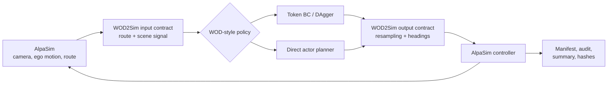

# WOD2Sim

<p align="center">
  <a href="https://github.com/amtellezfernandez/WOD2Sim/actions/workflows/ci.yml"></a>
  <a href="LICENSE"></a>
  
</p>

<p align="center">
  <strong>Run WOD-style trajectory policies as auditable AlpaSim external drivers.</strong><br>
  <a href="wod2sim.pdf">Paper</a> |
  <a href="docs/README.md">Documentation</a> |
  <a href="CITATION.cff">Citation</a>
</p>

WOD2Sim preserves the policy information lost at the dataset-to-simulator
boundary: route geometry, policy-facing scene state, trajectory timing, and run
provenance. It is an adapter and evaluation artifact, not a new driving policy.

## Visual Overview

<table>
  <tr>
    <td width="50%">
      <a href="https://waymo.com/intl/jp/open/data/motion/">
        
      </a>
      <br>
      <strong>Input side.</strong> WOD-style policies consume logged agent
      tracks, route context, and vector map geometry. The image links to the
      official Waymo Motion page and is not copied into this repository.
    </td>
    <td width="50%">
      
      <br>
      <strong>Simulator side.</strong> AlpaSim runs the adapted policy in a
      reactive scene, while WOD2Sim records the command, trajectory outputs, and
      audit artifacts needed to review the rollout.
    </td>
  </tr>
</table>

<p align="center">
  
</p>

<p align="center">
  
</p>

**Figure 1.** The images show the adapter boundary, not a benchmark result. The
terminal panel is a command-manifest example: `valid_claim_evidence` remains
false until an executed AlpaSim rollout is audited. The metrics dashboard
explains the runtime graph family: RPC timing, service queue depth, rollout
duration, step duration, CPU utilization, GPU utilization, GPU memory, and
service replica counts. These graphs diagnose execution health and capacity;
they do not evaluate policy quality.

## Architecture



**Figure 2.** WOD2Sim sits inside the closed loop. It translates AlpaSim state
into the policy contract, converts the returned five-second trajectory to the
runtime rate, and records evidence separately from policy behavior.

## Scope

- `token_dagger_bc` loads a compatible learned-policy checkpoint.
- `direct_actor_planner` evaluates continuous candidates using an actor proxy.
- Both adapters share route propagation, sensor checks, launch tooling, and audits.

This release contains no public checkpoint and makes no policy benchmark claim.

## Install

```bash
uv venv .venv
uv pip install --python .venv/bin/python -e ".[dev]"
wod2sim-doctor --strict-installed --json
```

Installation and command planning require neither AlpaSim nor a GPU.

## Plan A Run

```bash
wod2sim-reproduce \
  --model token_dagger_bc \
  --checkpoint /path/to/token_dagger_bc.pt \
  --scene-id example-scene \
  --run-dir /tmp/wod2sim/run \
  --evidence-dir /tmp/wod2sim/evidence \
  --json
```

The dry plan writes the complete command and evidence layout but correctly
reports `valid_claim_evidence: false`.

## Execute

Live rollouts require x86_64 Linux, Docker, NVIDIA Container Toolkit, a GPU, an
AlpaSim checkout, and local scene assets.

```bash
wod2sim-reproduce \
  --execute \
  --alpasim-root /path/to/alpasim \
  --model token_dagger_bc \
  --checkpoint /path/to/token_dagger_bc.pt \
  --scene-preset fresh_3scene \
  --run-dir runs/token_dagger_bc_fresh_3scene \
  --evidence-dir runs/token_dagger_bc_fresh_3scene/evidence \
  --json
```

Start with the [getting-started guide](docs/getting-started.md). The
[documentation index](docs/README.md) covers design, reproduction, evaluation,
and every public command.

## Verify

```bash
make verify
```

This runs lint, tests and coverage, a fresh-install smoke test, package builds,
and a clean paper rebuild.

## Citation

Use [`CITATION.cff`](CITATION.cff) for software metadata and
[`wod2sim.pdf`](wod2sim.pdf) for the accompanying paper.

## License And Disclaimer

WOD2Sim is released under the [BSD 3-Clause License](LICENSE). Packaged AlpaSim
overrides retain their [third-party notices](LICENSES/THIRD_PARTY_NOTICES.md).

This independent project is not affiliated with, endorsed by, or sponsored by
Waymo or NVIDIA. It does not redistribute Waymo datasets, AlpaSim binaries,
gated scene assets, private checkpoints, or rollout bundles.
