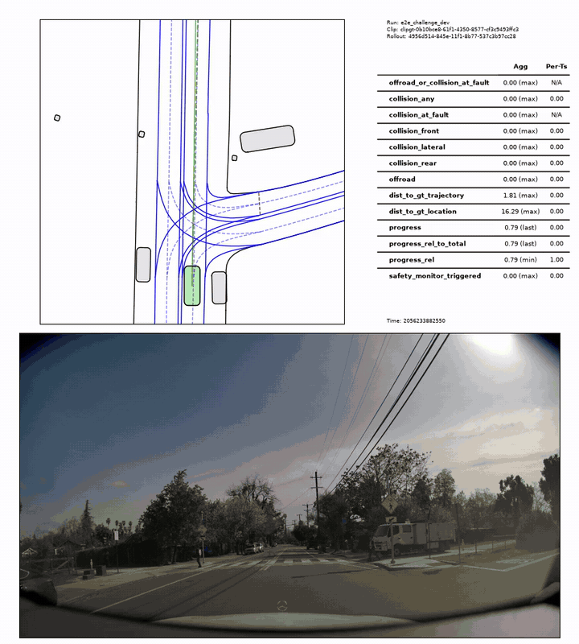

# WOD2Sim

<p align="center">
  <a href="https://github.com/amtellezfernandez/WOD2Sim/actions/workflows/ci.yml"></a>
  <a href="LICENSE"></a>
  
</p>

<p align="center">
  <strong>Run trajectory policies through AlpaSim's live external-driver loop.</strong><br>
  <a href="docs/getting-started.md">Get started</a> |
  <a href="docs/README.md">Documentation</a> |
  <a href="docs/cli.md">CLI reference</a>
</p>

WOD2Sim is an installable policy adapter and run toolchain for
[NVIDIA AlpaSim](https://github.com/NVlabs/alpasim). It translates live camera,
ego-motion, command, and route messages into a compact trajectory-policy
interface, converts the policy output to AlpaSim's trajectory format, and lets
AlpaSim's controller and physics advance the next ego state.

It also handles the work around the adapter: checkout setup, runtime readiness,
scene batching, retries, provenance, run audits, and support bundles. WOD2Sim is
not a simulator and does not introduce a new driving policy.

## Real AlpaSim Run

<p align="center">
  <a href="artifacts/external/alpasim_navsim_reactive_rollout/camera-map.mp4">
    
  </a>
</p>

This preview is transcoded directly from the retained
[19.9-second AlpaSim run](artifacts/external/alpasim_navsim_reactive_rollout/camera-map.mp4),
not generated from a hand-authored trajectory or synthetic visualization. In
that run:

- AlpaSim made `197` live `Drive` calls.
- The public NAVSIM EgoStatusMLP seed-0 checkpoint returned `197` finite
  trajectories.
- AlpaSim fed each trajectory through its controller and physics services.
- The renderer-requested ego position advanced from `(0.061, -0.001)` m to
  `(61.683, 0.546)` m.
- The rollout completed `19.93` simulated seconds.

The checkpoint is camera-blind and consumes ego status plus a discrete command.
The public AlpaSim fixture repeats one recorded camera frame, so the moving map
demonstrates the reactive ego loop while the camera panel demonstrates message
delivery only. This is integration evidence, not a visual-policy or
driving-quality benchmark. The exact configuration, raw telemetry, hashes, and
limitations are retained in the
[run evidence directory](artifacts/external/alpasim_navsim_reactive_rollout/).

## What Closes The Loop

```text
AlpaSim camera + ego motion + route
                  |
                  v
      WOD2Sim policy observation
                  |
                  v
     five-second ego trajectory
                  |
                  v
  timing conversion + output checks
                  |
                  v
      AlpaSim controller + physics
                  |
                  +----> next ego state
```

The same adapter surface supports four model presets:

| Preset | Purpose | Extra input |
| --- | --- | --- |
| `constant_velocity` | Dependency-light smoke baseline | None |
| `route_following` | Dependency-light waypoint baseline | None |
| `token_dagger_bc` | Adapter for a compatible learned token checkpoint | Local checkpoint |
| `direct_actor_planner` | Candidate planner using scene-matched actor state | Local actor proxy |

The first two presets are sufficient to test a checkout and execute the public
adapter without a private checkpoint.

## WOMD And Waymo Scope

The name WOD2Sim refers to the policy-side shape that motivated the adapter:
timestamped observations, route intent or geometry, and a short-horizon ego
trajectory. It does not mean that this branch converts Waymo Open Motion
Dataset (WOMD) scenarios into AlpaSim scenes.

| Goal | Supported here? | Recommended path |
| --- | --- | --- |
| Run a trajectory policy on an AlpaSim scene | Yes | Use `wod2sim-launch` or `wod2sim-reproduce`. |
| Connect a compatible learned policy to AlpaSim | Yes, with its required local checkpoint and inputs | Implement or select the matching model preset and declare its observation, frame, timing, and route requirements. |
| Train or evaluate directly on actual WOMD records | No | Use [Waymax](https://github.com/waymo-research/waymax) or another WOMD-native stack with licensed data. |
| Render an actual WOMD scenario inside AlpaSim | No | A separate licensed scene converter is required for maps, actors, signals, routes, clocks, and renderable assets. |
| Claim a fully reactive multi-agent counterfactual from logged WOMD agents | No | Logged non-ego futures are not a substitute for reactive agent models. |

See [WOMD targeting](docs/womd-targeting.md) before describing a run as
"Waymo in AlpaSim." The distinction matters: moving a policy interface is
implemented; moving the dataset and reconstructing its world is not.

## Install

Installation and command planning do not require a GPU:

```bash
uv sync --extra dev
uv run wod2sim-doctor --strict-installed --json
```

Live AlpaSim rollouts require x86_64 Linux, Docker, NVIDIA Container Toolkit, a
GPU, a local AlpaSim checkout, and local scene assets.

## Connect AlpaSim

Inspect the tracked override layer:

```bash
uv run wod2sim-setup \
  --alpasim-root /path/to/alpasim \
  --check-only
```

Apply it and run the readiness checks:

```bash
uv run wod2sim-setup --alpasim-root /path/to/alpasim
uv run wod2sim-ready \
  --alpasim-root /path/to/alpasim \
  --scene-preset fresh_3scene
```

The setup command validates the expected upstream layout before applying any
tracked file. The readiness command checks the local environment, Docker/GPU
availability, images, model inputs, and selected scene assets.

## Plan Or Execute

Materialize the exact driver and simulator commands without starting a rollout:

```bash
uv run wod2sim-launch \
  --mode print \
  --alpasim-root /path/to/alpasim \
  --model route_following \
  --scene-preset fresh_3scene
```

Execute the setup-to-evidence workflow:

```bash
uv run wod2sim-reproduce \
  --execute \
  --alpasim-root /path/to/alpasim \
  --model route_following \
  --scene-preset fresh_3scene \
  --run-dir runs/route_following \
  --evidence-dir runs/route_following/evidence \
  --json
```

For independent scene timeouts and retries, use `wod2sim-batch`. The toolchain
retains expanded configuration, model inputs, commands, simulator provenance,
driver events, summaries, and normalized audit output without committing gated
scene data or private checkpoints.

## Executed Compatibility Evidence

Two real AlpaSim integrations are retained:

| Run | Result | What it establishes |
| --- | --- | --- |
| [Reactive NAVSIM external driver](artifacts/external/alpasim_navsim_reactive_rollout/) | `197/197` finite outputs over one `19.93` s rollout | A published camera-blind checkpoint, the external driver, controller, and physics complete a live feedback loop in the pinned configuration. |
| [E2E challenge-style conformance](artifacts/external/alpasim_e2e_challenge_conformance/) | `1/1` rollout completed, `197` `Drive` calls | The packaged driver connects to the evaluator-owned AlpaSim service boundary and returns correctly timed trajectories. |

These are bounded integration runs. They do not establish policy superiority,
representative scenario coverage, multi-agent reactivity, comparative overhead,
or general performance on WOMD.

## Verify

```bash
make test
make verify
```

`make verify` runs Ruff, the dependency-light conformance tier, coverage, a
fresh-checkout installation smoke test, and wheel/sdist builds. The tests do
not require AlpaSim scenes, a GPU, or learned checkpoints.

## Documentation

- [Getting started](docs/getting-started.md)
- [Architecture and adapter behavior](docs/design.md)
- [WOMD targeting](docs/womd-targeting.md)
- [Reproducible runs](docs/reproduction.md)
- [CLI reference](docs/cli.md)
- [AlpaSim E2E compatibility](docs/challenge-compatibility.md)
- [Contributing](.github/CONTRIBUTING.md)

## License And Disclaimer

WOD2Sim is released under the [BSD 3-Clause License](LICENSE). Packaged
third-party-derived files and run media retain their
[third-party notices](LICENSES/THIRD_PARTY_NOTICES.md).

This independent project is not affiliated with, endorsed by, or sponsored by
Waymo or NVIDIA. It does not redistribute Waymo datasets, AlpaSim binaries,
gated scene assets, or policy checkpoints.
