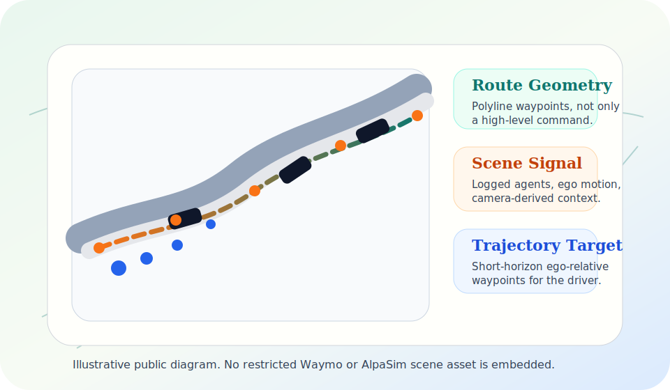
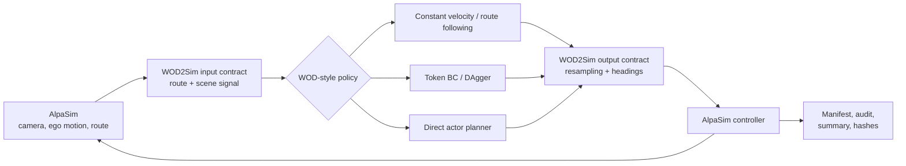

# WOD2Sim

<p align="center">
  <a href="https://github.com/amtellezfernandez/WOD2Sim/actions/workflows/ci.yml"></a>
  <a href="LICENSE"></a>
  
</p>

<p align="center">
  <strong>Separate integration failures from policy failures in closed-loop driving simulation.</strong><br>
  <a href="wod2sim.pdf">Paper</a> |
  <a href="docs/README.md">Documentation</a> |
  <a href="CITATION.cff">Citation</a>
</p>

WOD2Sim preserves the policy information lost at the dataset-to-simulator
boundary: route geometry, policy-facing scene state, trajectory timing, and run
provenance. Its purpose is to prevent boundary violations from being reported
as policy failures. It is a contract-validation integration framework, not a
new driving policy.

This repository has one canonical paper PDF: [`wod2sim.pdf`](wod2sim.pdf). The
paper source lives in [`paper/cvm`](paper/cvm), while the generated evidence,
manifests, tables, and figures live in [`artifacts/cvm`](artifacts/cvm).
Those directories are the reproducibility package for WOD2Sim; they are not a
separate project.
In public text, the **contract-validation matrix (CVM)** is the neutral
configured evidence matrix used to separate runnable rows, blockers,
diagnostics, and claim-valid policy evidence.

Here, **WOD-style** means a short-horizon trajectory-policy interface inspired
by the Waymo Open Motion Dataset setting: logged observations, route intent,
and ego-relative trajectory outputs. This repository does not claim official
Waymo challenge compatibility, leaderboard submission support, or a redistributable
Waymo-to-AlpaSim scene conversion.

## What This Release Proves

| Question | Current answer |
| --- | --- |
| Can WOD-style adapters run as auditable AlpaSim external drivers? | Yes. The dependency-light public core completes `30/30` closed-loop rows over `15` local scenes. |
| Does WOD2Sim prevent integration-invalid metrics from becoming policy evidence? | Yes. A defined status-only baseline accepts `15/15` completed metric-bearing command-only rows, while WOD2Sim rejects the same `15/15` as non-claim-valid route evidence. |
| Does the detector distinguish controlled faults from valid traces? | Yes, for the declared designed suite. On `15` single-fault mutations paired with `15` separately instantiated valid adapter sessions, WOD2Sim classifies `30/30`, localizes `15/15`, and flags `0/15` controls; the executable completion-and-metrics gate classifies `15/30` and detects no faults. These are exact descriptive counts, not a framework-superiority test. |
| What diagnostic timing is measured? | Post-parse fault-detector execution over `3,000` calls is `11.441 us` median and `21.915 us` p95. The guarded in-process adapter Drive path is `257.390 us` median and `449.371 us` p95; its paired camera-set and freshness-check increment is `25.630 us` median and `112.659 us` p95 over `1,000` measurements across `15` valid sessions, with identical output. Context-length validation remains active in both arms. The measurements exclude gRPC, simulator work, file I/O, and human investigation, so they are not end-to-end runtime or human time-to-diagnosis. |
| Are all paired route-loss rows comparison-eligible? | No. `14/15` pairs qualify; one full-contract arm is also route-invalid, and the paired score deltas do not establish a systematic policy effect. |
| Is this a policy-quality benchmark? | No. The release has `0` claim-valid policy benchmark rows, `0` policy-failure-attributable rows, and no verified scenario-category coverage. |

## Failure Attribution Boundary

WOD2Sim's central release rule is separation between integration failure and
policy failure. A closed-loop event can be interpreted as policy behavior or
policy failure only after the semantic route contract, temporal adapter,
lifecycle state, deployment preconditions, and evidence audit pass.

- The default attribution for an incomplete, blocked, ablated, or unaudited row
  is **not policy failure**. It remains an integration, precondition, runtime,
  or evidence row until the evidence gate explicitly makes it claim-valid.
- If route geometry is reduced to a command, sensors are stale, trajectory timing
  is malformed, lifecycle state is invalid, assets are missing, or evidence is
  incomplete, the row is an integration/precondition/evidence failure, not a
  policy failure.
- If the row is executed, audit-valid, and retained by the evidence gate, its
  behavior metrics can be inspected without a known boundary violation. A
  policy failure still requires the retained failure layer to be `policy`;
  degraded behavior alone is not enough.
- This release still reports no claim-valid policy benchmark. The CVM reports
  contract-valid rollouts, integration-invalid rows, blockers, diagnostics, and
  policy benchmark claims separately.

Public reports use this decision order:

| Row state | Allowed attribution |
| --- | --- |
| Missing route geometry, stale sensors, invalid timing, lifecycle error, missing asset, or incomplete evidence | Integration/precondition/evidence failure; never policy failure. |
| Executed and audit-valid, but benchmark prerequisites are still incomplete | Contract-valid diagnostic rollout; behavior is inspectable but not a public policy benchmark. |
| Executed, audit-valid, retained by the benchmark gate, and failure layer is `policy` | Policy failure may be assigned. |

The generated aggregate makes the boundary numeric: current artifacts contain
`42` policy-attributable behavior rows, `0` policy-attributable failure rows,
`33` integration/precondition blocker rows, and `73` completed non-policy diagnostic rows
that remain non-policy-attributed.
The success evidence is the completed side of that partition: `42/45`
full-contract closed-loop rollouts are audit-valid. The semantic comparison
uses a defined status-only rule: it accepts `15/15` completed metric-bearing
command-only rows, while WOD2Sim rejects those same `15/15` as non-claim-valid
route evidence. Only `14/15` semantic pairs have a valid full-contract arm and
an invalid command-only arm; their score deltas are descriptive only.
The `33` blocked rows stay in the denominator as remaining unsupported
direct-actor/temporal-ablation work.
The three completed full-contract rows outside the `42/45` audit-valid count
all come from the same scene and are kept out of policy attribution because the
audit found late command-proxy route fallback, despite successful rollout
completion.

External compatibility is recorded separately from the CVM benchmark gate. The
AlpaSim E2E-style conformance artifact completes `1/1` evaluator-owned rollout,
records `197` WOD2Sim driver RPCs and `396` image events, and meets the driver
latency target on `197/197` calls. This is interface-portability evidence, not
a challenge submission, leaderboard score, policy-quality benchmark, or
scenario-coverage claim. Its version-one telemetry predates the explicit
finite-output field, so it is not used as current-schema mutation evidence.

The controlled diagnostic experiment instead generates `15` separate sessions
through the current adapter: `405` events, `120` drive calls, and `120/120`
explicitly finite serialized trajectories. Each unmodified session is paired
with one predefined mutation. Mutation construction and detection are separate,
and the scorer does not pass expected labels to the detector. The tracked JSON
records case-level outcomes, exact paired counts, `3,000` fault-case detector
measurements, `6,000` all-case detector measurements, and `1,000` paired
guard-path measurements. No population confidence interval or hypothesis
test is reported because the cases are designed rather than independently
sampled.

## Scenario Coverage Boundary

The public CVM uses 15 locally cached 26.02 front-camera scene artifacts as
integration instances. The repository does not expose authoritative metadata
for straight roads, intersections, lane changes, dense traffic, occlusions, or
merges, so the generated coverage gate reports `0/6` verified required
scenario categories and `15` unclassified closed-loop scenes. WOD2Sim therefore
claims contract-valid integration behavior on those rows, not autonomous-driving
scenario-category coverage.

## Visual Overview

<table>
  <tr>
    <td width="50%">
      
      <br>
      <strong>Input side.</strong> WOD-style policies consume logged agent
      tracks, route context, and vector map geometry. This local illustration
      is not copied from or derived from restricted dataset assets.
    </td>
    <td width="50%">
      
      <br>
      <strong>Simulator side.</strong> AlpaSim runs the adapted policy in a
      reactive scene, while WOD2Sim records the command, trajectory outputs, and
      audit artifacts needed to review the rollout.
    </td>
  </tr>
</table>

<p align="center">
  
</p>

<p align="center">
  
</p>

**Figure 1.** The images show the adapter boundary, not a benchmark result. The
terminal panel is a command-manifest example: `valid_claim_evidence` remains
false until an executed AlpaSim rollout is audited. The metrics dashboard
explains the runtime graph family: RPC timing, service queue depth, rollout
duration, step duration, CPU utilization, GPU utilization, GPU memory, and
service replica counts. These graphs diagnose execution health and capacity;
they do not evaluate policy quality.

## Architecture



**Figure 2.** WOD2Sim sits inside the closed loop. It translates AlpaSim state
into the policy contract, converts the returned five-second trajectory to the
runtime rate, and records boundary validity before any rollout behavior can be
attributed to the policy.

## Scope

The public release core is the dependency-light adapter path:

- `constant_velocity` is a dependency-light straight-line baseline.
- `route_following` is a dependency-light waypoint-following baseline.

Optional gated extensions are exposed through the same contract surface, but
they are not release-core dependencies:

- `token_dagger_bc` loads a compatible learned-policy checkpoint.
- `direct_actor_planner` evaluates continuous candidates using a scene-matched actor proxy.
- All adapters share route propagation, sensor checks, launch tooling, and audits.

This release contains no public checkpoint, does not redistribute restricted
scene assets, and does not provide a complete public benchmark. Missing learned
checkpoints, scene-matched direct-actor proxies, and redistributable scene
subsets block learned-policy, actor-aware, and benchmark claims. They do not
block the dependency-light public core, which is the narrower executable
release surface. Claim-valid audits require executed rollouts with route
waypoints reaching every driver-log frame; command-proxy route fallback is
diagnostic only.

## Install

```bash
uv sync --extra dev
uv run wod2sim-doctor --strict-installed --json
```

The tracked `uv.lock` pins the public dependency snapshot. Installation and
command planning require neither AlpaSim nor a GPU. Repository `make` targets
prefer `uv run python` by default when `uv` is available, so they execute against
this locked environment after `uv sync`.

## Plan A Run

```bash
wod2sim-reproduce \
  --model constant_velocity \
  --scene-id example-scene \
  --run-dir /tmp/wod2sim/run \
  --evidence-dir /tmp/wod2sim/evidence \
  --json
```

The dry plan writes the complete command and evidence layout but correctly
reports `valid_claim_evidence: false`.

## Execute

Live rollouts require x86_64 Linux, Docker, NVIDIA Container Toolkit, a GPU, an
AlpaSim checkout, and local scene assets.

### WSL GPU Preflight

Dry planning, tests, paper builds, and synthetic diagnostics do not require a
GPU. Live AlpaSim rollouts do. On Windows/WSL2, verify that WSL can see the
NVIDIA adapter before running `--execute`:

```bash
nvidia-smi -L
docker run --rm --gpus all alpasim-base:0.66.0 nvidia-smi -L
```

If Windows PowerShell sees the GPU but WSL reports `GPU access blocked by the
operating system` or `WSL environment detected but no adapters were found`,
reset the WSL VM from Windows PowerShell and retry:

```powershell
wsl --shutdown
wsl -d Ubuntu -- bash -lc "nvidia-smi -L"
```

If the retry still fails, repair the Windows-side NVIDIA CUDA/WSL driver and
reboot Windows before launching WOD2Sim. Installing a Linux NVIDIA kernel driver
inside WSL is not the fix; WSL receives GPU access from the Windows driver.

```bash
wod2sim-reproduce \
  --execute \
  --alpasim-root /path/to/alpasim \
  --model constant_velocity \
  --scene-preset fresh_3scene \
  --run-dir runs/constant_velocity_fresh_3scene \
  --evidence-dir runs/constant_velocity_fresh_3scene/evidence \
  --json
```

Start with the [getting-started guide](docs/getting-started.md). The
[documentation index](docs/README.md) covers design, reproduction, evaluation,
and every public command.

## Benchmark Readiness

After executing real batches, aggregate each driver with `wod2sim-batch-summary`
and gate the public claim:

```bash
wod2sim-benchmark-readiness \
  --batch-summary summaries/constant_velocity.json \
  --batch-summary summaries/route_following.json \
  --batch-summary summaries/token_dagger_bc.json \
  --output summaries/benchmark-readiness.json \
  --json
```

The default gate requires 15 unique executed scenes, clean closed-loop summaries,
route-waypoint-backed audited frames, required behavior/runtime metrics, and
three baseline families. It exits nonzero until the real matrix exists.

## Verify

```bash
make conformance
make verify
```

`make conformance` runs the dependency-light core contract tier without torch,
checkpoints, Docker, GPU, or gated scenes. `make verify` runs lint, tests and
coverage, a fresh-install smoke test, package builds, and a clean paper rebuild
plus submission validation.

## Paper And Contract-Validation Artifacts

```bash
make cvm-check
make cvm-diagnostics
make cvm-synthetic
make cvm-aggregate
make paper-verify
```

`make paper-verify` rebuilds the canonical [`wod2sim.pdf`](wod2sim.pdf) from
the same generated tables and figures used by the repository reports, then runs
the submission validator. The current aggregate remains `claim_valid=false`:
the public core has completed `30/30` dependency-light rows over 15 scenes,
semantic ablations have completed `15/15` matched metric-bearing scene pairs,
the command-only route baseline demonstrates the separation between
integration-invalid evidence and policy evidence, direct-actor rows remain
optional gated extension blockers, and completed closed-loop rows are
diagnostic integration-effectiveness evidence rather than policy-quality
benchmark claims. The controlled trace experiment adds `30/30` case
classification, `15/15` localization, an executable status-only comparator,
post-parse detector execution latency, and a paired guard-path increment. These
software microbenchmarks do not measure end-to-end runtime or human
time-to-diagnosis, and the status-only comparator is not another integration
framework.
Missing restricted scenes, learned checkpoints, and scene-matched actor proxies
remain explicit release limitations rather than hidden infrastructure
assumptions.
The detailed test-to-contract traceability map is tracked in
[`artifacts/cvm/reports/contract_test_audit.md`](artifacts/cvm/reports/contract_test_audit.md).

## Ungated Demo

```bash
make demo
```

The demo writes a synthetic run directory under `demo/wod2sim-contract-demo`
with a driver log, route audit, aggregate JSON, support bundle, and SVG rollout
view. It uses public synthetic geometry and a constant-velocity stub only:
`valid_claim_evidence` stays false, no AlpaSim scene is executed, and no policy
quality metric is reported. The aggregate JSON includes synthetic conformance
diagnostics for command-proxy route loss and road-center/ego-route offset; those
demo checks are not used as closed-loop evaluation metrics. See
[the demo guide](docs/demo.md).

## Citation

Use [`CITATION.cff`](CITATION.cff) for software metadata and
[`wod2sim.pdf`](wod2sim.pdf) for the WOD2Sim paper.

## License And Disclaimer

WOD2Sim is released under the [BSD 3-Clause License](LICENSE). Packaged AlpaSim
overrides retain their [third-party notices](LICENSES/THIRD_PARTY_NOTICES.md).

This independent project is not affiliated with, endorsed by, or sponsored by
Waymo or NVIDIA. It does not redistribute Waymo datasets, AlpaSim binaries,
gated scene assets, private checkpoints, or rollout bundles.
