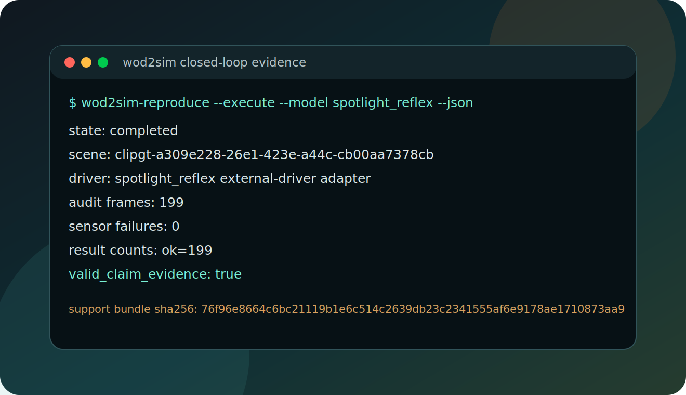
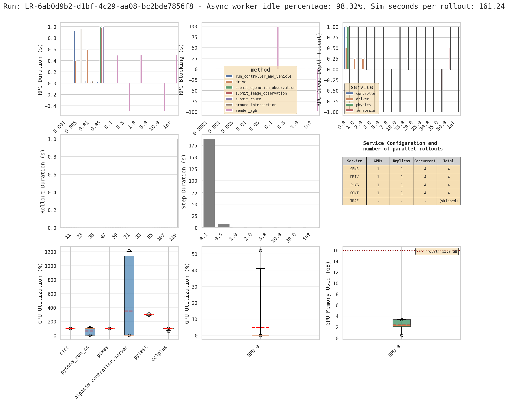
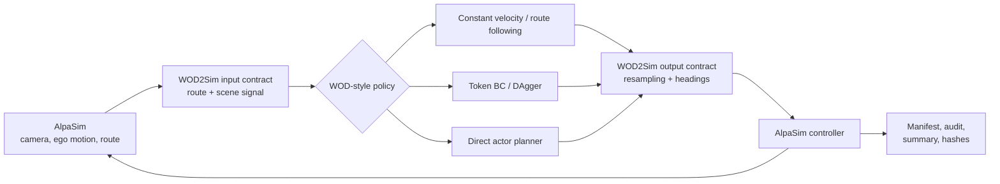

# WOD2Sim

<p align="center">
  <a href="https://github.com/amtellezfernandez/WOD2Sim/actions/workflows/ci.yml"></a>
  <a href="LICENSE"></a>
  
</p>

<p align="center">
  <strong>Run WOD-style trajectory policies as auditable AlpaSim external drivers.</strong><br>
  <a href="wod2sim.pdf">Paper</a> |
  <a href="docs/README.md">Documentation</a> |
  <a href="CITATION.cff">Citation</a>
</p>

WOD2Sim preserves the policy information lost at the dataset-to-simulator
boundary: route geometry, policy-facing scene state, trajectory timing, and run
provenance. It is a contract-validation integration framework, not a new
driving policy.

This repository has one canonical paper PDF: [`wod2sim.pdf`](wod2sim.pdf). The
paper source lives in [`paper/cvm`](paper/cvm), while the generated evidence,
manifests, tables, and figures live in [`artifacts/cvm`](artifacts/cvm).
Those directories are the reproducibility package for WOD2Sim; they are not a
separate project.

Here, **WOD-style** means a short-horizon trajectory-policy interface inspired
by the Waymo Open Dataset end-to-end setting: logged observations, route intent,
and ego-relative trajectory outputs. This repository does not claim official
Waymo challenge compatibility, leaderboard submission support, or a redistributable
Waymo-to-AlpaSim scene conversion.

## Failure Attribution Boundary

WOD2Sim's central release rule is separation between integration failure and
policy failure. A closed-loop event can be interpreted as policy behavior or
policy failure only after the semantic route contract, temporal adapter,
lifecycle state, deployment preconditions, and evidence audit pass.

- The default attribution for an incomplete, blocked, ablated, or unaudited row
  is **not policy failure**. It remains an integration, precondition, runtime,
  or evidence row until the evidence gate explicitly makes it claim-valid.
- If route geometry is reduced to a command, sensors are stale, trajectory timing
  is malformed, lifecycle state is invalid, assets are missing, or evidence is
  incomplete, the row is an integration/precondition/evidence failure, not a
  policy failure.
- If the row is executed, audit-valid, and retained by the evidence gate, its
  behavior metrics can be inspected without a known boundary violation. A
  policy failure still requires the retained failure layer to be `policy`;
  degraded behavior alone is not enough.
- This release still reports no claim-valid policy benchmark. The CVM reports
  contract-valid rollouts, integration-invalid rows, blockers, diagnostics, and
  policy benchmark claims separately.

The generated aggregate makes the boundary numeric: current artifacts contain
`0` policy-attributable behavior rows, `0` policy-attributable failure rows,
`36` integration/precondition blocker rows, and `109` completed diagnostic rows
that remain non-policy-attributed.

## Visual Overview

<table>
  <tr>
    <td width="50%">
      <a href="https://waymo.com/intl/jp/open/data/motion/">
        
      </a>
      <br>
      <strong>Input side.</strong> WOD-style policies consume logged agent
      tracks, route context, and vector map geometry. The image links to the
      official Waymo Motion page and is not copied into this repository.
    </td>
    <td width="50%">
      
      <br>
      <strong>Simulator side.</strong> AlpaSim runs the adapted policy in a
      reactive scene, while WOD2Sim records the command, trajectory outputs, and
      audit artifacts needed to review the rollout.
    </td>
  </tr>
</table>

<p align="center">
  
</p>

<p align="center">
  
</p>

**Figure 1.** The images show the adapter boundary, not a benchmark result. The
terminal panel is a command-manifest example: `valid_claim_evidence` remains
false until an executed AlpaSim rollout is audited. The metrics dashboard
explains the runtime graph family: RPC timing, service queue depth, rollout
duration, step duration, CPU utilization, GPU utilization, GPU memory, and
service replica counts. These graphs diagnose execution health and capacity;
they do not evaluate policy quality.

## Architecture



**Figure 2.** WOD2Sim sits inside the closed loop. It translates AlpaSim state
into the policy contract, converts the returned five-second trajectory to the
runtime rate, and records boundary validity before any rollout behavior can be
attributed to the policy.

## Scope

- `constant_velocity` is a dependency-light straight-line baseline.
- `route_following` is a dependency-light waypoint-following baseline.
- `token_dagger_bc` loads a compatible learned-policy checkpoint.
- `direct_actor_planner` evaluates continuous candidates using an actor proxy.
- All adapters share route propagation, sensor checks, launch tooling, and audits.

This release contains no public checkpoint and makes no policy benchmark claim.
Claim-valid audits require executed rollouts with route waypoints reaching every
driver-log frame; command-proxy route fallback is diagnostic only.

## Install

```bash
uv venv .venv
uv pip install --python .venv/bin/python -e ".[dev]"
wod2sim-doctor --strict-installed --json
```

Installation and command planning require neither AlpaSim nor a GPU.

## Plan A Run

```bash
wod2sim-reproduce \
  --model constant_velocity \
  --scene-id example-scene \
  --run-dir /tmp/wod2sim/run \
  --evidence-dir /tmp/wod2sim/evidence \
  --json
```

The dry plan writes the complete command and evidence layout but correctly
reports `valid_claim_evidence: false`.

## Execute

Live rollouts require x86_64 Linux, Docker, NVIDIA Container Toolkit, a GPU, an
AlpaSim checkout, and local scene assets.

```bash
wod2sim-reproduce \
  --execute \
  --alpasim-root /path/to/alpasim \
  --model constant_velocity \
  --scene-preset fresh_3scene \
  --run-dir runs/constant_velocity_fresh_3scene \
  --evidence-dir runs/constant_velocity_fresh_3scene/evidence \
  --json
```

Start with the [getting-started guide](docs/getting-started.md). The
[documentation index](docs/README.md) covers design, reproduction, evaluation,
and every public command.

## Benchmark Readiness

After executing real batches, aggregate each driver with `wod2sim-batch-summary`
and gate the public claim:

```bash
wod2sim-benchmark-readiness \
  --batch-summary summaries/constant_velocity.json \
  --batch-summary summaries/route_following.json \
  --batch-summary summaries/token_dagger_bc.json \
  --output summaries/benchmark-readiness.json \
  --json
```

The default gate requires 15 unique executed scenes, clean closed-loop summaries,
route-waypoint-backed audited frames, required behavior/runtime metrics, and
three baseline families. It exits nonzero until the real matrix exists.

## Verify

```bash
make conformance
make verify
```

`make conformance` runs the dependency-light core contract tier without torch,
checkpoints, Docker, GPU, or gated scenes. `make verify` runs lint, tests and
coverage, a fresh-install smoke test, package builds, and a clean paper rebuild.

## Paper And Contract-Validation Artifacts

```bash
make cvm-check
make cvm-synthetic
make cvm-aggregate
make cvm-paper
make cvm-validate
```

`make cvm-paper` rebuilds the canonical [`wod2sim.pdf`](wod2sim.pdf) from
the same generated tables and figures used by the repository reports. The
current aggregate remains `claim_valid=false`: dependency-light core rows and
semantic ablations have executed, direct-actor rows remain explicitly blocked,
and completed closed-loop rows are diagnostic integration evidence rather than
policy-quality benchmark claims.

The portable experiment vocabulary is the contract-validation matrix (CVM):
configured rows, executed rows, blocked rows, and claim-valid evidence are
reported separately.

## Ungated Demo

```bash
make demo
```

The demo writes a synthetic run directory under `demo/wod2sim-contract-demo`
with a driver log, route audit, aggregate JSON, support bundle, and SVG rollout
view. It uses public synthetic geometry and a constant-velocity stub only:
`valid_claim_evidence` stays false, no AlpaSim scene is executed, and no policy
quality metric is reported. The aggregate JSON includes synthetic diagnostics
for command-proxy route loss and road-center/ego-route offset. See
[the demo guide](docs/demo.md).

## Citation

Use [`CITATION.cff`](CITATION.cff) for software metadata and
[`wod2sim.pdf`](wod2sim.pdf) for the WOD2Sim paper.

## License And Disclaimer

WOD2Sim is released under the [BSD 3-Clause License](LICENSE). Packaged AlpaSim
overrides retain their [third-party notices](LICENSES/THIRD_PARTY_NOTICES.md).

This independent project is not affiliated with, endorsed by, or sponsored by
Waymo or NVIDIA. It does not redistribute Waymo datasets, AlpaSim binaries,
gated scene assets, private checkpoints, or rollout bundles.
